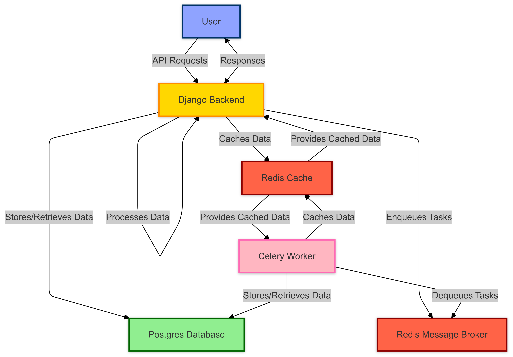

# System Architecture

This document provides an overview of the system architecture for the Mapapi project. It outlines the main components, data flow, and interactions within the system.

## Overview

Mapapi is designed to manage and visualize environment-related incidents. The architecture is built to support scalability, reliability, and efficient data processing.

## Components

1. **Django Backend**: Serves as the core of the application, handling API requests, business logic, and data management.
2. **Postgres Database**: Stores user data, incident reports, and other persistent information.
3. **Celery**: Manages asynchronous tasks, such as sending notifications and processing data in the background.
4. **Redis**: Acts as a message broker for Celery and provides caching capabilities to improve performance.

## Data Flow

1. **API Requests**: Users interact with the system through RESTful API endpoints provided by the Django backend.
2. **Data Processing**: Incoming data is validated and processed by the backend, with tasks delegated to Celery for asynchronous handling.
3. **Database Operations**: Data is stored and retrieved from the Postgres database, ensuring consistency and reliability.
4. **Caching and Messaging**: Redis is used to cache frequently accessed data and facilitate communication between components.

## Diagrams

## Conclusion

The Mapapi architecture is designed to efficiently handle a wide range of operations related to environment-related incidents. By leveraging Django, Postgres, Celery, and Redis, the system provides a robust and scalable solution.

For more detailed information, refer to the individual component documentation and source code.
